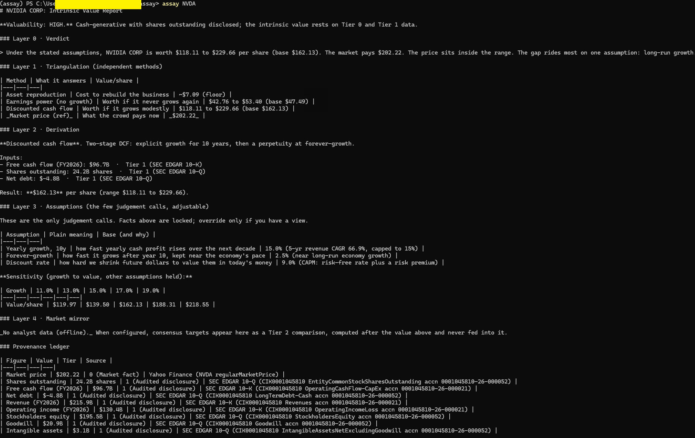
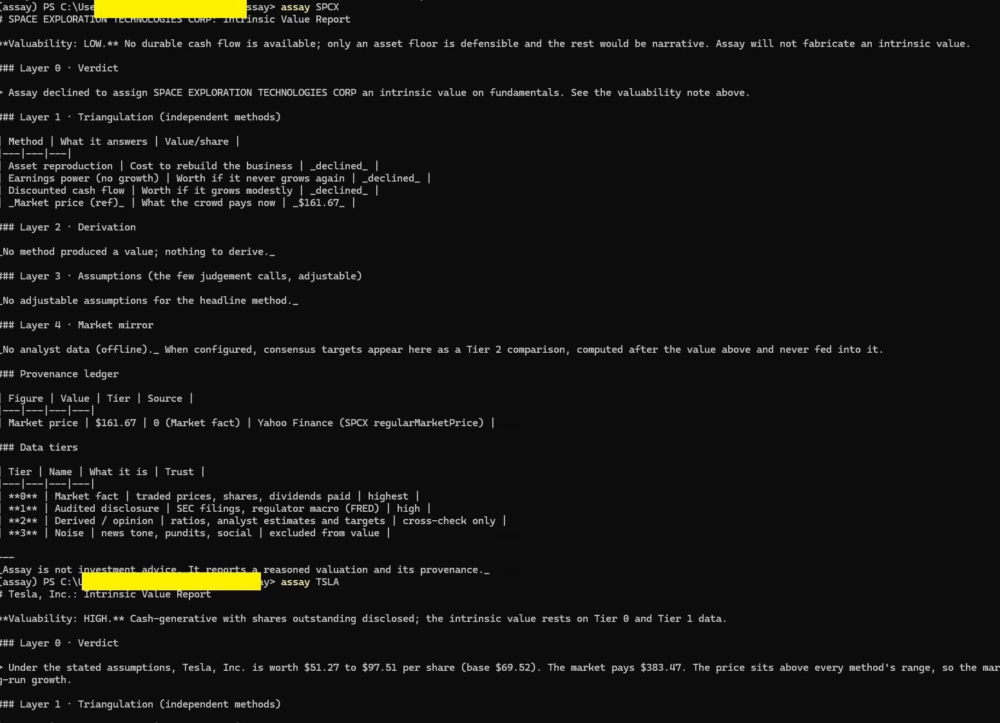
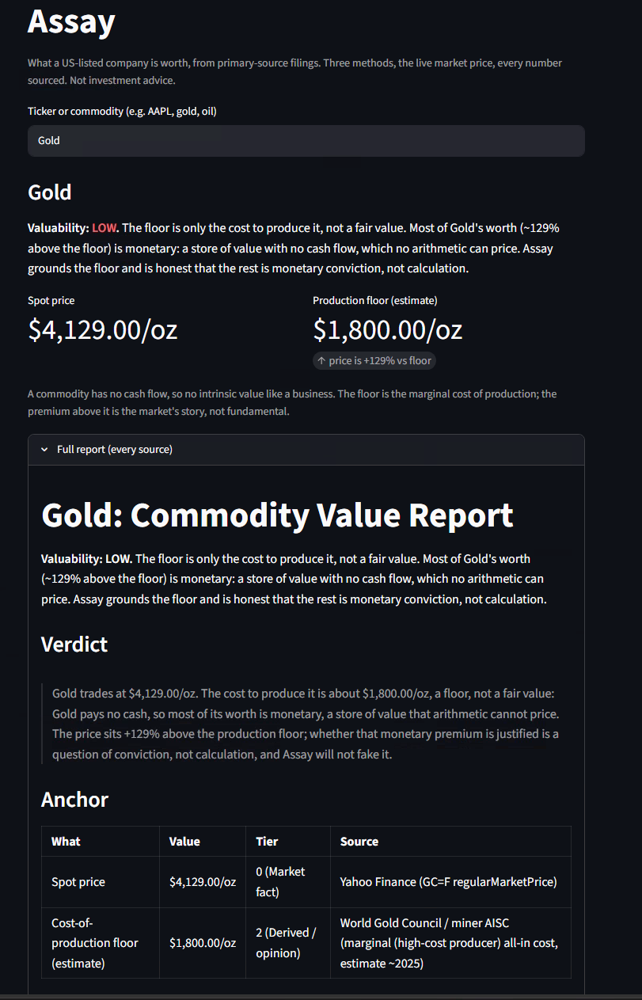
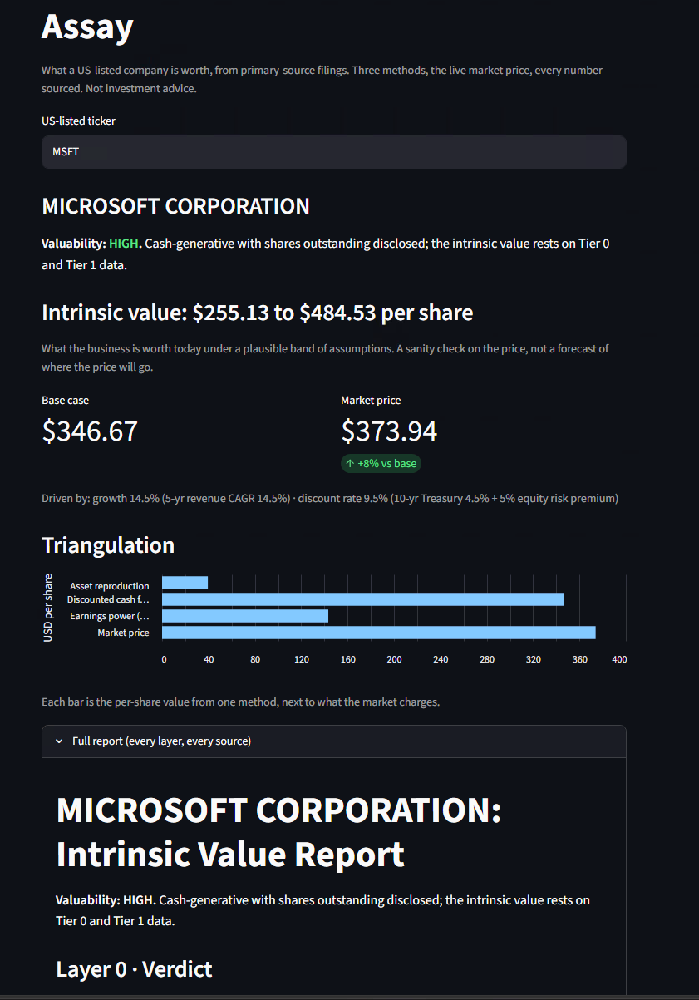

# Assay

Stepping into 2026, I found myself doubting something basic: do I actually understand how the economy and the markets work? Prices jump on news that is half rumor and already stale by the time it reaches me. Official figures get quietly revised a quarter later. Every few weeks a new idea (AI, quantum, crypto) insists the old rules are dead. In that noise it is easy to chase the tide and call it investing, and most people who chase it lose.

So I wanted to look the other way, toward the part that does not move. Long before today's panic, careful people worked out how to tell what a business is actually worth, and that arithmetic does not care about inflation scares or a viral post. A company is worth the cash it can produce and the assets it holds. That durable, almost stubborn idea of value is the thing I wanted in my own hands, so I built a tool for it.

**That tool is Assay. It tells you what a US-listed company is *worth*, from primary-source facts, with every number traceable back to the filing it came from.** Price is what the market pays today. Value is what the cash and assets are actually worth. Assay measures the second one, and shows its work.

The name is deliberate: to *assay* is to test ore and determine its true metal content. That is what this does to a business.

> **Status: scaffold.** The architecture, the data-credibility model, and the report shape are in place, and `assay demo` runs the whole pipeline end to end on a fictional company with no API key. Real data adapters (SEC EDGAR, FRED, prices) are stubbed with their endpoints documented and filled in next.

## Why this is not another stock-valuation site

The category is not empty. Morningstar, Simply Wall St, stockanalysis.com, GuruFocus and others all print a "fair value." Assay's whole point is a different *discipline*, and it is the combination that is rare:

| | Typical valuation sites | **Assay** |
|---|---|---|
| Where the numbers come from | a vendor's pre-chewed dataset | straight from the regulator (SEC EDGAR, FRED), every figure tagged with its source |
| When fundamentals don't apply | prints a DCF number anyway | **refuses honestly**: "this can't be valued on fundamentals, here is only the floor" |
| Mixing data of different quality | sentiment, technicals, fundamentals blended | **tiered**: a Tier 3 rumor never silently touches a Tier 1 number |
| How many methods | usually one (a DCF) | **triangulation**: three independent methods, and where they disagree is itself a signal |
| Who computes the value | increasingly an LLM that can hallucinate | **deterministic code**; the LLM only writes prose and is *forbidden* from stating a number the math didn't produce |
| Who it's for | depends | a non-expert can read it (plain words up front), an expert can audit it (exact terms one tap away) |

This is not a blue ocean and the README won't pretend it is. It is a defensible point of view: **provenance, honest refusal, tiered truth, and no AI-invented numbers.** If a salesperson chasing the day's hype loves the output, something has gone wrong.

**Assay is not investment advice.** It outputs a reasoned valuation and its provenance. What you do with the gap between value and price is yours.

## What the output looks like

`assay NVDA` on real data, no keys: a three-method intrinsic value against the live market price.



When the fundamentals are not there, Assay refuses rather than inventing a number. `assay SPCX` resolves to SpaceX, which has a market price but no durable cash flows in its filings, so every method declines:



A single report, layered so you can stop at any depth (full reasoning in [`docs/DESIGN.md`](docs/DESIGN.md)):

- **Layer 0 (Verdict).** One honest sentence. "Worth $34 to $53 (base $44); market pays $48.20; the whole gap rides on one assumption: long-run growth."
- **Layer 1 (Triangulation).** Three independent methods side by side, versus price.
- **Layer 2 (Derivation).** The math, and the source of every input.
- **Layer 3 (Assumptions).** The handful of future guesses, each overridable, with a sensitivity table and Conservative / Base / Optimistic stances.
- **Layer 4 (Market mirror).** Analyst targets, clearly labeled as opinion, computed *after* and never fed into the value. The gap is the product.
- Plus a **valuability** banner (how much of the value rests on hard data versus narrative) and a **provenance ledger** (every figure, its tier, its source).

## Commodities

Assay also values commodities, on their own terms. A commodity produces no cash, so there is no discounted cash flow and no intrinsic value the way a business has one. The honest anchor is the **cost of production**: the marginal (high-cost) producer's cost, the floor below which supply contracts and the price tends to recover. Assay reports the live spot price against that floor and is plain that the premium above it is the market's story, not a fundamental value.

```bash
assay gold        # also: oil, silver, natgas, copper (the UI handles them too)
```



Gold is the sharpest case. It pays nothing and is held, not consumed, so most of its price is monetary and store-of-value demand far above the production floor. Assay grounds the floor and refuses to fake a value for the rest, because whether that premium is justified is a question of conviction, not calculation. (The floor is a curated industry estimate, the one place Assay leans on a hand-set number, and its tier label says so.)

## The data-credibility tiers

Assay never claims a number is "true." It ranks every number by how hard it is to lie about, and carries that tier with the number everywhere.

| Tier | Name | What it is | Trust |
|---|---|---|---|
| **0** | Market fact | traded prices, shares outstanding, dividends paid | highest |
| **1** | Audited disclosure | SEC filings, regulator macro data (FRED) | high |
| **2** | Derived / opinion | ratios, analyst estimates and targets | cross-check only |
| **3** | Noise | news tone, pundits, social | excluded from value |

## Quickstart

```bash
uv venv && uv pip install -e ".[dev]"   # or: python -m venv .venv && pip install -e ".[dev]"
assay demo                               # full report on a fictional company, no API key needed
pytest                                   # unit tests
```

No API keys or signup required. `assay AAPL` works out of the box: filings come free from SEC EDGAR (which only asks for a contact string in `ASSAY_SEC_USER_AGENT`), and prices come from a free, keyless source. Optional keys (Tiingo for prices, FRED for the discount rate) only upgrade data quality; they never gate the app.

## Interactive UI (optional)

For a visual version, install the UI extra and launch the local app:

```bash
uv pip install -e ".[ui]"
assay-ui            # or: streamlit run assay/ui/app.py
```

Type a ticker, then drag the assumption sliders (growth, discount rate, forever-growth) and watch the valuation and the triangulation recompute live. Same engine, same numbers, a friendlier view.



## How it works

1. **Data** (`assay/data`): per-source adapters fetch primary figures and tag each with its `Tier` and `Source`. SEC EDGAR for filings, FRED for the risk-free rate, a price API for the quote. Nothing downstream accepts a bare number.
2. **Models** (`assay/models`): each valuation method (DCF, earnings power, asset value) is an isolated module with one contract, tier-tagged figures plus explicit assumptions in, a value range out. They never read each other's state.
3. **Engine** (`assay/engine`): runs every method (`triangulate`), scores how anchorable the company is (`valuability`), and assembles the layered report (`report`), all deterministic.
4. **Narrate** (`assay/narrate`): *optional*. An LLM behind a provider-agnostic interface writes the plain-English prose around the numbers. A deterministic guard rejects any prose that introduces a number not already in the computed report.

For the reasoning behind every choice, see [`docs/DESIGN.md`](docs/DESIGN.md).

## Layout

```
assay/      data (tier-tagged adapters) · models (isolated valuation methods) · engine (triangulate, valuability, report) · narrate (optional LLM prose + grounding guard)
docs/       DESIGN.md: architecture, philosophy, the tiers and layers
tests/      unit tests (provenance, DCF, the no-invented-number guard)
data/       gitignored cache for fetched filings and API responses
```

## License

MIT. Uses only public, unrestricted libraries and public data (SEC EDGAR, FRED).
